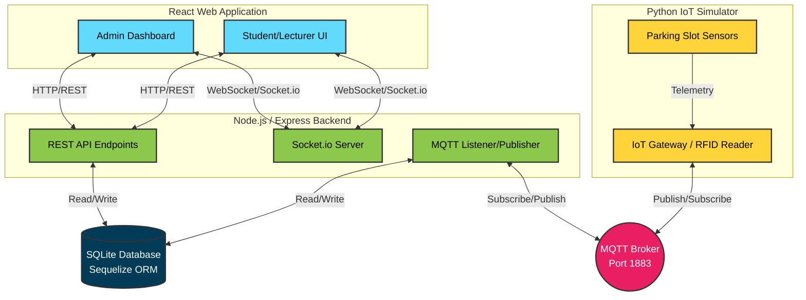
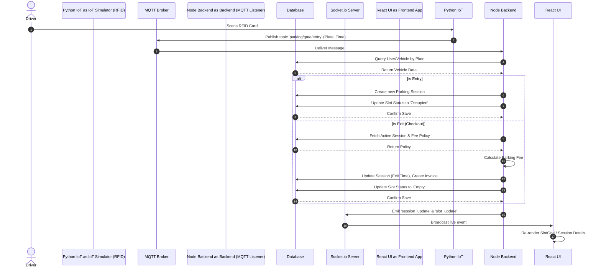
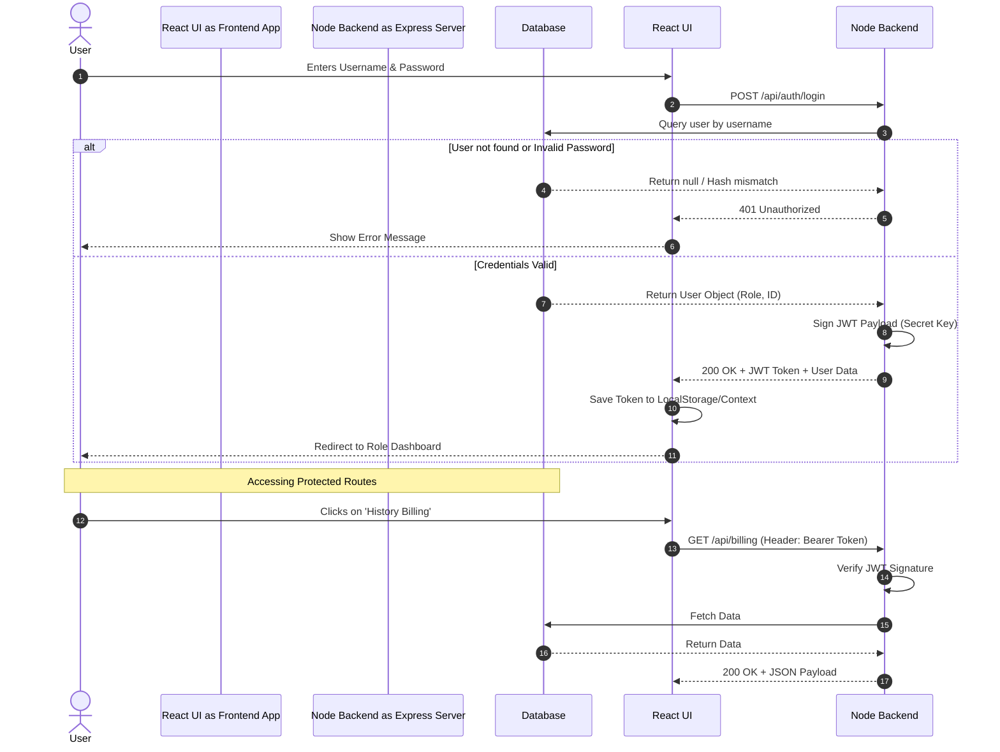
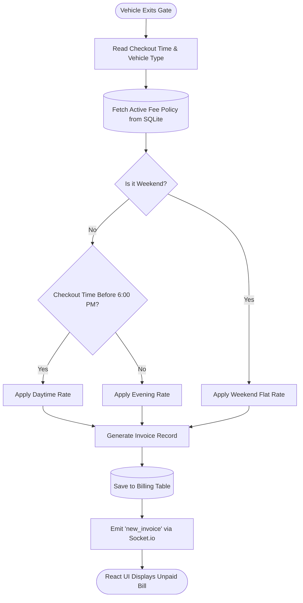
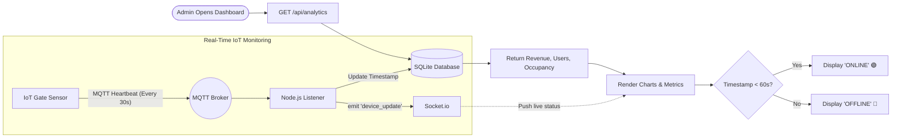

# Smart Parking System - End-to-End Operational Flow

This document maps out the comprehensive end-to-end operational flow of the Smart Parking System. The technology stack consists of a **React Frontend**, a **Node.js/Express Backend**, an **SQLite Database** (via Sequelize), and a **Python IoT Simulator** communicating via **MQTT**.

---

## 1. High-Level System Architecture

This architecture diagram illustrates how all core components of the system interconnect. It highlights the dual communication protocols used: **REST APIs** for standard CRUD operations and **Socket.io/MQTT** for real-time bidirectional data flow.

**Explanation:**
- The **React Web Application** serves different views for Admins and standard Users (Students/Lecturers).
- The **Node.js Backend** exposes REST APIs for persistent data (users, policies) and uses Socket.io to push live updates to the frontend.
- The **SQLite Database** acts as the central source of truth for all structured data.
- The **Python IoT Simulator** mimics physical hardware (RFID readers, proximity sensors) and streams data to the Node.js backend via an **MQTT Broker**.

---

## 2. IoT Vehicle Entry/Exit & Real-time Flow

This sequence diagram maps the exact flow of data from the moment a vehicle scans an RFID card at a physical gate, all the way to the UI update on the user's phone or admin dashboard.

**Explanation:**
1. A driver presents an RFID card (simulated by Python script).
2. The Python script publishes the scan event to the MQTT broker.
3. The Node.js backend, listening to the broker, receives the payload and checks the SQLite database.
4. If it's an entry, a new session is created. If it's an exit, the system calculates the fee based on the duration and policy, then generates an invoice.
5. The backend emits an event via Socket.io to all connected web clients.
6. The React frontend instantly updates the parking map and session history without requiring a page refresh.

---

## 3. Authentication & Authorization Flow

This sequence diagram illustrates the secure login process using JSON Web Tokens (JWT) to ensure that users only access permitted resources.

**Explanation:**
1. The user submits credentials which are verified against the hashed password in SQLite.
2. Upon success, the Node.js server generates a JWT containing the user's identity and role.
3. The React frontend stores this token and attaches it as a `Bearer` header to all subsequent API requests.
4. The backend middleware verifies the JWT on protected routes before querying the database, ensuring strict authorization control between Admin, Student, and Lecturer roles.

---

## 4. Dynamic Fee Policy & Billing Flow

This flowchart demonstrates the logic engine used to calculate dynamic parking fees based on temporal conditions (e.g., time of day, day of the week) configured by the Admin.

**Explanation:**
1. When a vehicle exits, the system determines the exact exit timestamp and the type of vehicle (Car/Motorbike).
2. It fetches the currently active `FeePolicy` from the database.
3. The logic tree checks if the current day is a weekend. If not, it checks if the exit time is before or after the 6:00 PM threshold.
4. The calculated rate is used to generate a new billing invoice, which is saved to the database.
5. Finally, a real-time event alerts the user's app that they have a new pending payment.

---

## 5. Admin Dashboard & Device Monitoring Flow

This flowchart explains how the Admin Dashboard maintains a live overview of system health by combining historical data with real-time heartbeat monitoring of physical IoT hardware.

**Explanation:**
1. Upon loading the dashboard, the React app makes a standard REST call to retrieve aggregated analytics (e.g., total revenue, daily occupancy).
2. Concurrently, IoT devices publish lightweight "heartbeat" messages to the MQTT broker every 30 seconds.
3. The Node.js backend processes these heartbeats and broadcasts them to the Admin UI via Socket.io.
4. The frontend evaluates the last seen timestamp. If a device hasn't checked in within 60 seconds, its status automatically degrades to "Offline", allowing admins to instantly spot hardware failures.
